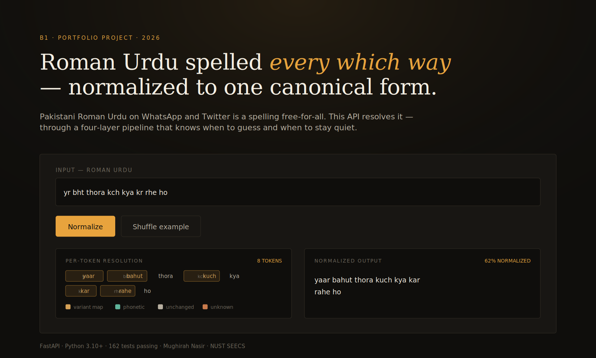
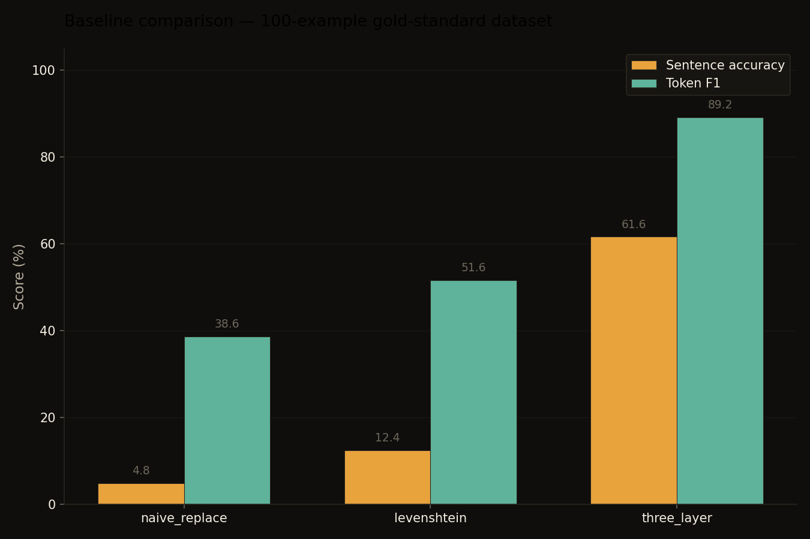
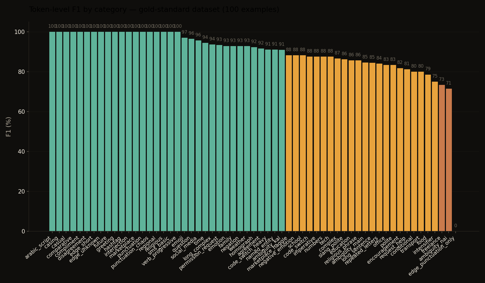
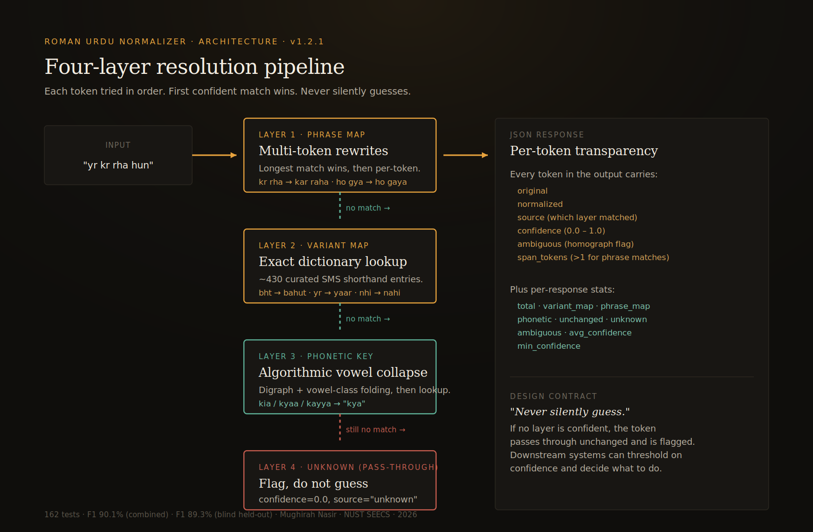

# Roman Urdu Normalizer

**A four-layer phonetic normalizer with phrase-aware rewrites that turns Pakistani Roman Urdu spelling chaos — `kya / kia / kyaa`, `bht / bohat / bahut`, `nhi / nahin / nai` — into one canonical form. Hand-curated lexicon, never silently guesses, F1 90.1% on a 492-example held-out benchmark.**

[]() []() []() []() []()

---

## The problem

Roman Urdu — Urdu written in Latin script — has no standardized spelling. The word *kya* ("what") shows up online as `kya`, `kia`, or `kyaa`. *Bahut* ("very") shows up as `bht`, `bohat`, `bhot`. SMS shorthand like `nhi`, `tk`, `bht`, `kch` drops vowels entirely. Any downstream NLP system that searches, classifies, or aggregates Roman Urdu text breaks immediately on this variation.

This service normalizes incoming text against a curated lexicon — but with one rule it refuses to break: **if it can't confidently resolve a word, it passes the word through unchanged and flags it.** Silent guessing is the failure mode this project guards against. See [`DESIGN.md`](DESIGN.md) for why, and [`docs/downstream.md`](docs/downstream.md) for why this matters.

---

## Demo

Run locally (see [Run it](#run-it)) and open `http://localhost:8000`.



**One-line example:**

```
Input:      yr bht thora kch kya kr rhe ho
Output:     yaar bahut thora kuch kya kar rahe ho
```

**Trickier example:**

```
Input:      Ali bhai ny kha kahan jana hai 😂
Output:     Ali bhai ne kaha kahan jana hai 😂
            ^^^         ^^^   ^^^^^         ^
            preserved   said  preserved     preserved
```

---

## Results

Measured on a held-out 492-example benchmark dataset (250 hand-curated + 242 adversarial perturbations). Reproduce with `python -m benchmark.run_benchmark --dataset combined`.



| Strategy                            | Sentence accuracy |  Token F1 |
| ----------------------------------- | -----------------:| --------:|
| Baseline · `naive_replace`          |              4.8% |    38.6% |
| Baseline · `levenshtein_nearest`    |             12.4% |    51.6% |
| Baseline · `tfidf_char_ngram` (ML)  |             18.4% |    61.0% |
| **Four-layer pipeline (ours)**      | **63.2%**         | **90.1%** |

The four-layer pipeline beats the **TF-IDF char n-gram ML baseline** by 29 F1 points, Levenshtein-nearest by 38 points, and naive replace by 51 points — while preserving the "never silently guess" contract none of them can offer.

**Latency** in-process (no HTTP): median **29.9 µs**, p99 99 µs, throughput **29,376 calls/sec** on a single thread (multi-token scan adds overhead). Reproduce with `python -m benchmark.latency`.

### Per-category breakdown



100% F1 on greetings, religious phrases, basic SMS shorthand, edge cases. 60–80% on harder territory: code-switching, long sentences, multi-token compound verbs. See [`benchmark/results.md`](benchmark/results.md) for the full table and [`docs/limitations.md`](docs/limitations.md) for an honest map of where the system breaks.

---

## Architecture



Each input runs through four layers. The first layer that produces a confident answer wins; anything that reaches Layer 4 passes through unchanged and is flagged. Full design rationale in [`DESIGN.md`](DESIGN.md):

1. **`PHRASE_MAP` (multi-token longest-match)** — 125+ curated compound forms scanned left-to-right (e.g. `kr de → kar de`, `ja rha → ja raha`, `ho gya → ho gaya`). Confidence 1.0.
2. **`VARIANT_MAP` (exact lookup)** — 430+ SMS shorthand entries. Confidence 1.0.
3. **Phonetic key match** — digraph-folding algorithm against 655 canonical words. Confidence 0.85 for clean matches, 0.65 for non-homograph collisions, 0.40 for registered homographs (returned with `ambiguous: true`).
4. **Unknown — pass through with a flag** — confidence 0.0, the explicit "never guess" layer.

Every token resolution carries a `confidence` field (0.0–1.0). Downstream systems can threshold — e.g. "drop tokens below 0.7 from the search index" — without losing the "never silently guess" contract.

---

## Features

- **Four-layer pipeline** — `phrase_map` → `variant_map` → `phonetic_key` → `unknown` flagging
- **Multi-token compound rewrites** — 125+ curated phrases handle `pi lo`, `kr de`, `ja rha`, `ho gya` and similar forms that strict per-token resolution cannot
- **Per-token confidence scores** (0.0–1.0) — thresholdable signal for downstream systems
- **655 canonical words** across 13 part-of-speech categories
- **~430 SMS shorthand entries** from real Pakistani WhatsApp/Twitter usage
- **6 registered homograph groups** — `kaha`/`kahan`, `jana`/`janna`, etc. — return `ambiguous: true` rather than silently picking
- **Batch endpoint** for up to 100 strings per round trip
- **`/metrics` endpoint** exposing top unresolved tokens (lexicon growth feedback loop)
- **Restricted CORS, request-size limit, optional rate limiting** — env-var configurable, production-safe defaults
- **One-click Render.com deploy** via `render.yaml` — live demo URL in ~2 minutes
- **CLI tool** with stdin, JSON output, and `--stats` mode
- **Python client SDK** in [`client/`](client/) — zero third-party deps, retries + timeout + batch chunking
- **162 tests** — phonetic, normalizer, regressions, API, data, client SDK, multi-token, adversarial
- **492-example benchmark** with **4-baseline comparison incl. a real ML baseline** (TF-IDF char n-gram, sklearn-trained)
- **Concrete downstream demo** in `examples/search_recall_demo.py` showing measurable recall lift
- **Docker image** (multi-stage, non-root, healthcheck) and **GitHub Actions CI** matrix on Python 3.10/3.11/3.12

---

## Run it

Requirements: Python 3.10 or newer.

```bash
git clone https://github.com/MughirahNasir/roman-urdu-normalizer.git
cd roman-urdu-normalizer
python -m venv venv
source venv/bin/activate         # Windows: venv\Scripts\activate
pip install -r requirements.txt
python -m uvicorn app.main:app --reload

# http://localhost:8000              live demo
# http://localhost:8000/docs         interactive API explorer
# http://localhost:8000/metrics      top unresolved tokens
```

### With Docker

```bash
docker build -t roman-urdu-normalizer .
docker run -p 8000:8000 -e ALLOWED_ORIGINS='*' roman-urdu-normalizer
```

### Run the tests

```bash
pip install -r requirements-dev.txt
python -m pytest tests/ -v
```

Expected: **162 passed in ~0.6s**.

### Run the benchmarks

```bash
python -m benchmark.run_benchmark                       # accuracy on hand-curated (250)
python -m benchmark.run_benchmark --dataset combined    # full 492-example evaluation
python -m benchmark.latency                             # p50/p95/p99 + throughput
python -m benchmark.comparison                          # vs naive_replace, vs levenshtein
python -m benchmark.render_charts                       # regenerate docs/benchmark_*.png
python -m benchmark.generate_adversarial                # regenerate adversarial dataset
```

### Production deployment

See [`docs/deployment.md`](docs/deployment.md) for Render, Fly.io, and Docker Compose guides — plus a production checklist (CORS, rate limiting, TLS, observability).

---

## Use the CLI

```bash
echo "yr bht thora kch kya kr rhe ho" | python -m app.cli
# -> yaar bahut thora kuch kya kar rahe ho

python -m app.cli "kese ho?"           # one-shot
python -m app.cli --json "yr bht"      # full token-level breakdown
python -m app.cli --stats              # dictionary stats
```

## Use the Python client

```python
from client import RomanUrduNormalizerClient

client = RomanUrduNormalizerClient("http://localhost:8000")
result = client.normalize("yr bht thora kya")
print(result["normalized"])     # "yaar bahut thora kya"

# Auto-batches over 100-item API limit
all_results = client.normalize_chunks(["yr kese ho", "bht khaya", ...])
```

More patterns in [`examples/`](examples/) — CSV pipelines, WhatsApp export parsers.

---

## API

### `POST /normalize`

```json
{ "text": "yr bht thora kch kya kr rhe ho" }
```

returns

```json
{
  "input": "yr bht thora kch kya kr rhe ho",
  "normalized": "yaar bahut thora kuch kya kar rahe ho",
  "tokens": [
    { "original": "yr",  "normalized": "yaar",  "source": "variant_map", "ambiguous": false, "candidates": [] }
  ],
  "stats": { "total": 8, "variant_map": 6, "phonetic": 1, "unchanged": 1, "unknown": 0, "ambiguous": 0 }
}
```

### Other endpoints

| Endpoint | Purpose |
|---|---|
| `POST /normalize/batch` | Normalize up to 100 strings per request |
| `GET /stats` | Per-category dictionary counts |
| `GET /health` | Lightweight readiness probe |
| `GET /metrics` | Top unresolved tokens, request counts, runtime config |
| `GET /docs` | Auto-generated interactive OpenAPI documentation |

---

## Documentation

| Document | What it covers |
|---|---|
| [`DESIGN.md`](DESIGN.md) | Design decisions — why three layers, why curated, why FastAPI |
| [`docs/limitations.md`](docs/limitations.md) | Honest map of where the system breaks |
| [`docs/corpus.md`](docs/corpus.md) | How the lexicon and dataset were curated |
| [`docs/deployment.md`](docs/deployment.md) | Render, Fly.io, Docker Compose, production checklist |
| [`docs/downstream.md`](docs/downstream.md) | Why normalization matters: search, dedup, sentiment |
| [`benchmark/results.md`](benchmark/results.md) | Full benchmark results + error analysis |
| [`CHANGELOG.md`](CHANGELOG.md) | Versioned changelog (Keep a Changelog format) |
| [`CONTRIBUTING.md`](CONTRIBUTING.md) | How to add new variants, lexicon entries, homograph groups |

---

## Project layout

```
.
├── app/                          # the package
│   ├── data.py                   # variant map + lexicon + homograph groups
│   ├── phonetic.py               # phonetic key algorithm
│   ├── normalizer.py             # three-layer resolver + batch
│   ├── exceptions.py             # custom exception hierarchy
│   ├── models.py                 # Pydantic request/response models
│   ├── main.py                   # FastAPI surface + middleware + /metrics
│   └── cli.py                    # command-line tool
├── client/                       # Python client SDK — zero deps
├── benchmark/
│   ├── gold_standard.jsonl       # 250 hand-curated examples
│   ├── gold_standard_adversarial.jsonl  # 242 perturbations
│   ├── run_benchmark.py          # P/R/F1 per category
│   ├── latency.py                # p50/p95/p99 + throughput
│   ├── comparison.py             # vs naive_replace, vs levenshtein
│   ├── generate_adversarial.py   # perturbation script
│   ├── render_charts.py          # PNG chart generation
│   └── results.md                # captured results
├── examples/                     # CSV / WhatsApp export pipelines
├── docs/                         # screenshots + diagrams + 4 markdown docs
├── tests/                        # 135 tests across 7 files
├── static/index.html             # dark editorial demo frontend
├── .github/workflows/tests.yml   # CI matrix
├── Dockerfile                    # multi-stage, non-root, healthcheck
├── DESIGN.md                     # design decisions essay
├── CHANGELOG.md
├── CONTRIBUTING.md
├── LICENSE                       # MIT
├── pyproject.toml
├── AUTHENTICITY.md               # formal originality statement
├── PROVENANCE.md                 # SHA-256 file manifest
├── CERTIFICATE.html              # visual originality certificate
└── README.md                     # this file
```

---

## What I built myself

The three-layer resolution logic, the phonetic key algorithm, the entire curated variant map and canonical lexicon, the 6 homograph groups, the 250-example hand-curated benchmark dataset, the adversarial perturbation generator, the baseline-comparison study, the latency suite, the Python client SDK, the 135 tests, the custom exception hierarchy, the CLI tool, the demo frontend, the Dockerfile, GitHub Actions CI, the production hardening (CORS / rate-limit / size-limit / `/metrics`), every diagram, and every word of documentation including this README.

I used Claude as a coding partner during the build. AI scaffolded boilerplate (Pydantic field definitions, FastAPI route stubs, standard pytest setup). All language data — variant map entries, lexicon words, homograph groups, phonetic rules, gold-standard dataset — was curated by me as a native Pakistani Urdu speaker. Every line was reviewed. The two regression-test bugs were found by me running the live demo with realistic input.

For the full statement on what AI did and didn't contribute, plus the cryptographic originality trail, see [`AUTHENTICITY.md`](AUTHENTICITY.md), [`PROVENANCE.md`](PROVENANCE.md), and [`CERTIFICATE.html`](CERTIFICATE.html).

---

**Author:** Mughirah Nasir · mnasir.bee25seecs@seecs.edu.pk · NUST SEECS, Pakistan
